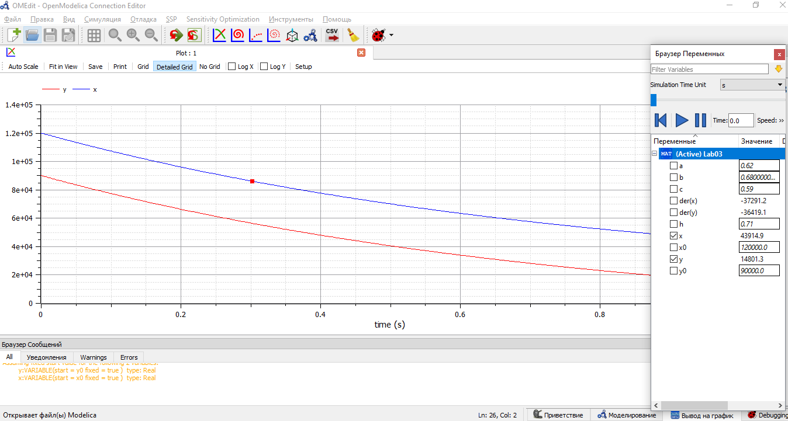

---
# Front matter
lang: ru-RU
title: "Лабораторная работа №3 по математическому моделированию"
subtitle: "Модель боевых действий"
author: "Хусайнова Фароиз Дилшодовна"

# Formatting
toc-title: "Содержание"
toc: true # Table of contents
toc_depth: 2
lof: true # List of figures
lot: true # List of tables
fontsize: 12pt
linestretch: 1.5
papersize: a4paper
documentclass: scrreprt
polyglossia-lang: russian
polyglossia-otherlangs: english
mainfont: PT Serif
romanfont: PT Serif
sansfont: PT Sans
monofont: PT Mono
mainfontoptions: Ligatures=TeX
romanfontoptions: Ligatures=TeX
sansfontoptions: Ligatures=TeX,Scale=MatchLowercase
monofontoptions: Scale=MatchLowercase
indent: true
pdf-engine: lualatex
header-includes:
  - \linepenalty=10 # the penalty added to the badness of each line within a paragraph (no associated penalty node) Increasing the value makes tex try to have fewer lines in the paragraph.
  - \interlinepenalty=0 # value of the penalty (node) added after each line of a paragraph.
  - \hyphenpenalty=50 # the penalty for line breaking at an automatically inserted hyphen
  - \exhyphenpenalty=50 # the penalty for line breaking at an explicit hyphen
  - \binoppenalty=700 # the penalty for breaking a line at a binary operator
  - \relpenalty=500 # the penalty for breaking a line at a relation
  - \clubpenalty=150 # extra penalty for breaking after first line of a paragraph
  - \widowpenalty=150 # extra penalty for breaking before last line of a paragraph
  - \displaywidowpenalty=50 # extra penalty for breaking before last line before a display math
  - \brokenpenalty=100 # extra penalty for page breaking after a hyphenated line
  - \predisplaypenalty=10000 # penalty for breaking before a display
  - \postdisplaypenalty=0 # penalty for breaking after a display
  - \floatingpenalty = 20000 # penalty for splitting an insertion (can only be split footnote in standard LaTeX)
  - \raggedbottom # or \flushbottom
  - \usepackage{float} # keep figures where there are in the text
  - \floatplacement{figure}{H} # keep figures where there are in the text
---

# Цель работы

Ознакомиться с одной из простейших моделей боевых действий – моделью Ланчестера. 

# Задание

Было необходимо:

-   построить график изменения численности войск армии Х и армии У для случая боевых действий между регулярными войсками.
-   построить график изменения численности войск армии Х и армии У для ведения боевых действий с участием регулярных войск и партизанских отрядов.

# Выполнение лабораторной работы

Известны начальные данные задачи: начальная численность войска X = 120000 человек, а численность войска Y = 90000 человек.  
Коэффициенты влияния различных факторов для войск X и Y в первом случае - a = 0.62 и h = 0.71 соответственно, во втором случае - a = 0.38 и h = 0.71 соответственно.  
Коэффициенты эффективности боевых действий для войск X и Y в первом случае - b = 0.68 и c = 0.59 соответственно, во втором случае - b = 0.68 и c = 0.21 соответственно.  
Функции подкрепления к войскам X и Y в первом случае - p(t) = sin(2t) и q(t) = cos(2t) соответственно, во втором случае - p(t) = sin(2t) и q(t) = cos(2t) соответственно.  
  
1. Рассмотрим модель боевых действий для двух регулярных армий:
$$\frac{dx}{dt}=-0,62x(t)-0,68y(t)+sin(2t) $$
$$\frac{dy}{dt}=-0,59x(t)-0,71y(t)+cos(2t) $$
Скриншот кода программы для 1ого случая, выполненной на языке программирования Modelica. (Figure 1) 

{ #fig:001 width=70% }  

График модели (Figure 2) 

{ #fig:001 width=70% }  

2. Рассмотрим модель ведения боевых действий с участием регулярной и партизанской армий:
$$\frac{dx}{dt}=-0,38x(t)-0,68y(t)+sin(2t) $$
$$\frac{dy}{dt}=-0,21x(t)y(t)-0,71y(t)+cos(2t) $$
Скриншот кода программы для 2ого случая, выполненной на языке программирования Modelica. (Figure 3) 

{ #fig:001 width=70% }  

График модели (Figure 4)  

{ #fig:001 width=70% }  

# Выводы

Ознакомилась с простейшей моделью боевых действий - моделью Ланчестера и научилась строить эту модель в программе Modelica.
